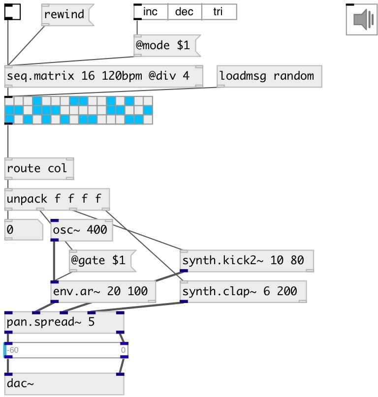

[index](index.html) :: [seq](category_seq.html)
---

# seq.matrix

###### sequencer control for ui.matrix

*available since version:* 0.9.1

---

## arguments:

* **N**
number of steps 
_type:_ int 

* **T**
time interval between steps or bpm 
_type:_ float 

## methods:

* **start**
start sequencer from current position 

* **reset**
reset all counters and stop 

* **rewind**
reset all counters without stopping 

* **stop**
stop sequencer 

* **tick**
output current sequence element and move to next 

## properties:

* **@t** 
Get/set time between beats. Unit values like 100ms or 240bpm also can be used 
_type:_ float 
_units:_ ms 
_range:_ 1..20000 
_default:_ 250 

* **@r** 
Get/set number of whole sequence repeats. If -1: repeat infinitely 
_type:_ int 
_min value:_ -1 
_default:_ -1 

* **@inf** 
Get/set alias to @r -1, repeats infinitely 
_type:_ alias 

* **@once** 
Get/set alias to @r 1, play once 
_type:_ alias 

* **@dur** 
Get/set whole sequence duration. (Recalculates @t property accordingly) 
_type:_ float 
_units:_ ms 
_min value:_ 0 
_default:_ 4000 

* **@i** (readonly)
Get current sequence iteration 
_type:_ int 
_min value:_ 0 
_default:_ 0 

* **@ri** (readonly)
Get current repeat iteration 
_type:_ int 
_min value:_ 0 
_default:_ 0 

* **@mode** 
Get/set sequencer mode. &#39;inc&#39;: from first to last, &#39;dec&#39;: from last to first, &#39;tri&#39;:
from first to last, then back 
_type:_ symbol 
_enum:_ inc, dec, tri 
_default:_ inc 

* **@n** 
Get/set number of cols in matrix 
_type:_ int 
_min value:_ 0 
_default:_ 16 

## inlets:

* reset all counters and start sequencer 
_type:_ control
* reset 
_type:_ control

## outlets:

* output for ui.matrix 
_type:_ control
* [i IDX N( - sequence iteration, [ri IDX N( - repeat iteration or [done( when done 
_type:_ control

## keywords:

[seq](keywords/seq.html)
[sequencer](keywords/sequencer.html)
[bang](keywords/bang.html)
[pattern](keywords/pattern.html)
[rythm](keywords/rythm.html)
[matrix](keywords/matrix.html)

**See also:**
[\[ui.matrix\]](ui.matrix.html)

**Authors:** Serge Poltavsky

**License:** GPL3 or later

