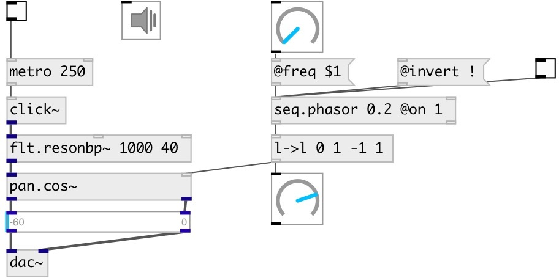

[index](index.html) :: [seq](category_seq.html)
---

# seq.phasor

###### control rate phasor (saw) generator

*available since version:* 0.9.1

---

## information
Outputs saw signal in [0..1] or [0..1) range.
Note: control rate in PureData depends on block size and samplerate. Do not rely
            on strict timing for this object, especially at high frequencies!

## arguments:

* **FREQ**
frequency 
_type:_ float 
_units:_ Hz 

* **ON**
on/off initial state 
_type:_ int 

## methods:

* **start**
start from current position 

* **reset**
reset phase and stop 

* **rewind**
reset phase without stopping 

* **stop**
stop 

* **tick**
output current value and move to next 

## properties:

* **@freq** 
Get/set frequency 
_type:_ float 
_units:_ Hz 
_range:_ 0..100 
_default:_ 0 

* **@on** 
Get/set on/off state 
_type:_ int 
_enum:_ 0, 1 
_default:_ 0 

* **@invert** 
Get/set saw inversion mode. If true, outputs descreasing waveform 
_type:_ int 
_enum:_ 0, 1 
_default:_ 0 

* **@steps** 
Get/set numbers of steps 
_type:_ int 
_min value:_ 3 
_default:_ 128 

* **@open** 
Get/set output in open [0..1) range, otherwise output range is [0..1] 
_type:_ int 
_enum:_ 0, 1 
_default:_ 0 

## inlets:

* 1: starts output, 0: stop 
_type:_ control
* reset phase to 0 
_type:_ control

## outlets:

* float value in 0..1 range 
_type:_ control
* bang after full cycle 
_type:_ control

## keywords:

[seq](keywords/seq.html)
[lfo](keywords/lfo.html)
[phasor](keywords/phasor.html)
[saw](keywords/saw.html)

**Authors:** Serge Poltavsky

**License:** GPL3 or later

