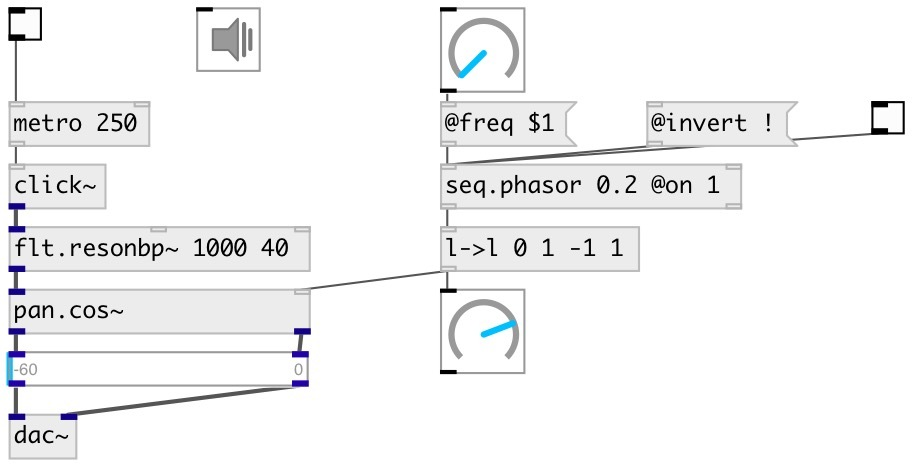

[index](index.html) :: [seq](category_seq.html)
---

# seq.phasor

###### control rate phasor (saw) generator

*available since version:* 0.9.1

---

## information
Outputs saw signal in [0..1] or [0..1) range.
Note: control rate in PureData depends on block size and samplerate. Do not rely
            on strict timing for this object, especially at high frequencies!

## arguments:

* **FREQ**
frequency 
__type:__ float 
__units:__ Hz 

* **ON**
on/off initial state 
__type:__ int 

## methods:

* **start**
start from current position 

* **reset**
reset phase and stop 

* **rewind**
reset phase without stopping 

* **stop**
stop 

* **tick**
output current value and move to next 

## properties:

* **@freq** 
Get/set frequency 
__type:__ float 
__units:__ Hz 
__range:__ 0..100 
__default:__ 0 

* **@on** 
Get/set on/off state 
__type:__ int 
__enum:__ 0, 1 
__default:__ 0 

* **@invert** 
Get/set saw inversion mode. If true, outputs descreasing waveform 
__type:__ int 
__enum:__ 0, 1 
__default:__ 0 

* **@steps** 
Get/set numbers of steps 
__type:__ int 
__min value:__ 3 
__default:__ 128 

* **@open** 
Get/set output in open [0..1) range, otherwise output range is [0..1] 
__type:__ int 
__enum:__ 0, 1 
__default:__ 0 

## inlets:

* 1: starts output, 0: stop 
__type:__ control 
* reset phase to 0 
__type:__ control 

## outlets:

* float value in 0..1 range
__type:__ control 
* bang after full cycle
__type:__ control 

## keywords:

[seq](keywords/seq.html)
[lfo](keywords/lfo.html)
[phasor](keywords/phasor.html)
[saw](keywords/saw.html)

**Authors:** Serge Poltavsky

**License:** GPL3 or later

