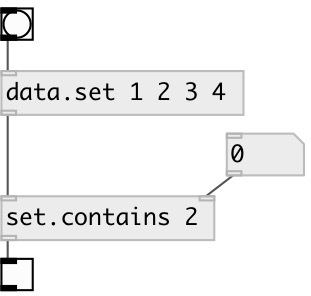

[index](index.html) :: [data](category_data.html)
---

# set.contains

###### check if specified element is in set

*available since version:* 0.3

---

## arguments:

* **SUBJ**
searched element 
_type:_ atom 

## properties:

* **@subj** 
Get/set searched element 
_type:_ atom 
_default:_ null 

## inlets:

* input set. Other values are ignored 
_type:_ control
* set searched element 
_type:_ control

## outlets:

* 1 if element exists in set, otherwise 0 
_type:_ control

## keywords:

[data](keywords/data.html)
[predicate](keywords/predicate.html)
[contains](keywords/contains.html)

**See also:**
[\[data.set\]](data.set.html)

**Authors:** Serge Poltavsky

**License:** GPL3 or later

