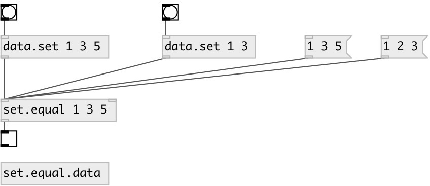

[index](index.html) :: [data](category_data.html)
---

# set.equal

###### checks if two sets are equal (contains same elements)

*available since version:* 0.3

---

## arguments:

* **ARGS**
right set elements 
__type:__ any 

## properties:

* **@subj** 
Get/set right set elements of data:Set 
__type:__ list 
__default:__ Set() 

## inlets:

* set or list, other values are ignored. 
__type:__ control 
* set right set elements 
__type:__ control 

## outlets:

* output 1 if sets are equal, 0 otherwise
__type:__ control 

## keywords:

[data](keywords/data.html)
[equal](keywords/equal.html)
[set](keywords/set.html)

**See also:**
[\[data.set\]](data.set.html)

**Authors:** Serge Poltavsky

**License:** GPL3 or later

