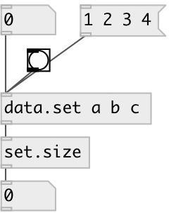

[index](index.html) :: [data](category_data.html)
---

# set.size

###### get number of elements in set

*available since version:* 0.3

---

## inlets:

* input set. Other values are ignored 
__type:__ control 

## outlets:

* number of element in set
__type:__ control 

## keywords:

[data](keywords/data.html)
[set](keywords/set.html)
[size](keywords/size.html)

**See also:**
[\[data.set\]](data.set.html)

**Authors:** Serge Poltavsky

**License:** GPL3 or later

