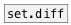

[< reference home](index.html)
---

# set.symdiff


symmetric difference between two sets

---

Symmetric difference, of two sets is the set of elements which are in either of
            the sets and not in their intersection
<br>


---


```


[B]
|
[data.set A B C D]
|
[set.symdiff C D E F]
|
[set->list @sort]
|
[msg set]
|
[ (

            
```

---
arguments:

ARGS: right set elements<br>

---
properties:


---
see also:<br>
[](data.set.html)
[](set.diff.html)
