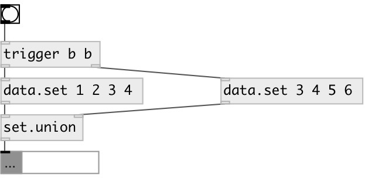

[index](index.html) :: [data](category_data.html)
---

# set.union

###### output union of given sets

*available since version:* 0.3

---

## arguments:

* **ARGS**
right set elements 
__type:__ any 

## inlets:

* first set or list (converted to set), other values are ignored 
__type:__ control 
* second set or list (converted to set) 
__type:__ control 

## outlets:

* output union of given sets
__type:__ control 

## keywords:

[data](keywords/data.html)
[union](keywords/union.html)
[set](keywords/set.html)

**See also:**
[\[data.set\]](data.set.html)
[\[set.intersect\]](set.intersect.html)

**Authors:** Serge Poltavsky

**License:** GPL3 or later

