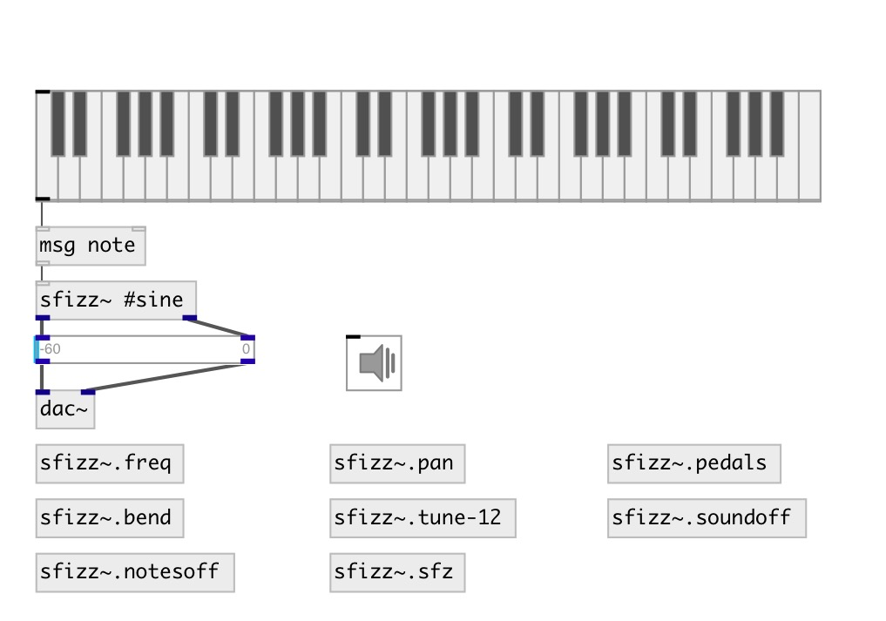

[index](index.html) :: [misc](category_misc.html)
---

# sfizz~
**aliases:** [ceammc/sfizz\~]

###### SFZ format sample player

*available since version:* 0.9.4

---

## arguments:

* **SF**
soundfont path or builtin waveform name: #sine, #tri, #saw, #square, #noise 
_type:_ symbol 

## methods:

* **note**
play note 
  __parameters:__
  - **[CHAN=0]** MIDI channel, ignored 
    type: int  

  - **NOTE** MIDI note 
    type: int  
    required: True  

  - **VEL** MIDI velocity 
    type: float  
    required: True  

* **cc**
control change 
  __parameters:__
  - **[CHAN=0]** MIDI channel, ignored 
    type: int  

  - **CC** MIDI control number 
    type: int  
    required: True  

  - **VAL** MIDI control value 
    type: float  
    required: True  

* **aftertouch**
aftertouch channel pressure 
  __parameters:__
  - **[CHAN=0]** MIDI channel, ignored 
    type: int  

  - **VEL** MIDI velocity 
    type: float  
    required: True  

* **polytouch**
polytouch key pressure 
  __parameters:__
  - **[CHAN=0]** MIDI channel, ignored 
    type: int  

  - **NOTE** MIDI note 
    type: int  
    required: True  

  - **VEL** MIDI velocity 
    type: float  
    required: True  

* **prog**
program change 
  __parameters:__
  - **[CHAN=0]** MIDI channel, if zero or ommited set for all channels 
    type: int  

  - **PGM** program number 
    type: int  
    required: True  

* **bend**
pitchband change 
  __parameters:__
  - **[CHAN=0]** MIDI channel, ignored 
    type: int  

  - **VALUE** value in 0..0x3fff range, with 0x2000 center. 
    type: int  
    required: True  

* **bend:i**
pitchband change 
  __parameters:__
  - **[CHAN=0]** MIDI channel, ignored 
    type: int  

  - **VALUE** value in -0x2000..0x1fff range, with 0 center. 
    type: int  
    required: True  

* **bend:f**
pitchband change 
  __parameters:__
  - **[CHAN=0]** MIDI channel, ignored 
    type: int  

  - **VALUE** value in -1..+1 range, with 0 center. 
    type: float  
    required: True  

* **bendsens**
set pitchbend sensitivity (NOT SUPPORTED, this is stub function) 
  __parameters:__
  - **[CHAN=0]** MIDI channel, ignored 
    type: int  

  - **RANGE** semitones sensitivity 
    type: int  
    units: semitone  
    required: True  

* **tune:12**
set octave tuning program in cents deviations 
  __parameters:__
  - **BANK** tuning bank (not related to MIDI instrument bank) 
    type: int  
    required: True  

  - **PRESET** tuning preset (not related to MIDI instrument program) 
    type: int  
    required: True  

  - **TUNES** list of scale deviations from 12TET in cents 
    type: list  
    required: True  

* **tunesel**
select tuning bank and preset 
  __parameters:__
  - **BANK** tuning bank (not related to MIDI instrument bank) 
    type: int  
    required: True  

  - **PRESET** tuning preset (not related to MIDI instrument program) 
    type: int  
    required: True  

* **panic**
send MIDI system reset command (big red &#39;panic&#39; button), turns off notes,
resets controllers and restores initial basic channel configuration 

* **reset**
reset all synth channels 

* **notes_off**
turn off all notes on a MIDI channel (put them into release phase) 
  __parameters:__
  - **[CHAN=0]** MIDI channel 
    type: int  

* **sounds_off**
immediately stop all notes on a MIDI channel (skips release phase). 
  __parameters:__
  - **[CHAN=0]** MIDI channel 
    type: int  

* **pan**
set channel panning 
  __parameters:__
  - **[CHAN]** MIDI channel, ignored 
    type: int  

  - **PAN** pan value, 0: left, 8192(0x2000): center, 16383(0x3fff): right 
    type: float  
    required: True  

* **pan:f**
set channel panning 
  __parameters:__
  - **[CHAN]** MIDI channel, ignored 
    type: int  

  - **PAN** pan value, -1: left, 0: center, 1): right 
    type: float  
    required: True  

* **pan:i**
set channel panning 
  __parameters:__
  - **[CHAN]** MIDI channel, ignored 
    type: int  

  - **PAN** pan value, -8192(-0x2000): left, 0: center, 8191(0x1fff): right 
    type: float  
    required: True  

* **hold**
hold (sustain, right) pedal, ignore note release when active, release all notes
when set to off. 
  __parameters:__
  - **CHAN** MIDI channel 
    type: int  
    required: True  

  - **VAL** pedal state 
    type: int  
    required: True  

* **sostenuto**
sostenuto (middle) pedal, hold notes pressed before pedal activation, new notes
are passed untouched. Release holded notes when set to off 
  __parameters:__
  - **CHAN** MIDI channel, ignored 
    type: int  
    required: True  

  - **VAL** pedal state 
    type: int  
    required: True  

* **soft**
soft (left) pedal, activate the soft strike effect 
  __parameters:__
  - **CHAN** MIDI channel, ignored 
    type: int  
    required: True  

  - **VAL** pedal state 
    type: int  
    required: True  

* **legato**
enable or disable legato/smooth transitions between consecutive notes 
  __parameters:__
  - **CHAN** MIDI channel, ignored 
    type: int  
    required: True  

  - **VAL** pedal state 
    type: int  
    required: True  

* **midi**
send raw midi message to synth 
  __parameters:__
  - **BYTES** list of bytes 
    type: list  
    required: True  

## properties:

* **@sf** 
Get/set soundfont path or builtin waveform name: #sine, #tri, #saw, #square, #noise 
_type:_ symbol 

* **@poly** 
Get/set max number of voices 
_type:_ int 
_range:_ 1..256 
_default:_ 64 

* **@avoices** (readonly)
Get number midi channels 
_type:_ int 
_default:_ 0 

* **@freq** 
Get/set A4 standard tuning 
_type:_ float 
_units:_ Hz 
_default:_ 440 

* **@key_labels** (readonly)
Get dict of control key labels 
_type:_ atom 
_default:_ [] 

* **@cc_labels** (readonly)
Get dict of controller labels 
_type:_ atom 
_default:_ [] 

* **@gain** 
Get/set output gain (same as @value but in amp units) 
_type:_ float 
_range:_ 0..16 
_default:_ 0.429 

* **@volume** 
Get/set output volume (same as @gain but in db) 
_type:_ float 
_units:_ db 
_range:_ -60..10 
_default:_ -7.35 

## inlets:

* load mod file 
_type:_ control

## outlets:

* left channel and property output 
_type:_ audio
* right channel 
_type:_ audio

## keywords:

[mod](keywords/mod.html)
[player](keywords/player.html)
[midi](keywords/midi.html)
[soundfont](keywords/soundfont.html)
[fluid](keywords/fluid.html)

**Authors:** Serge Poltavsky

**License:** GPL3 or later

