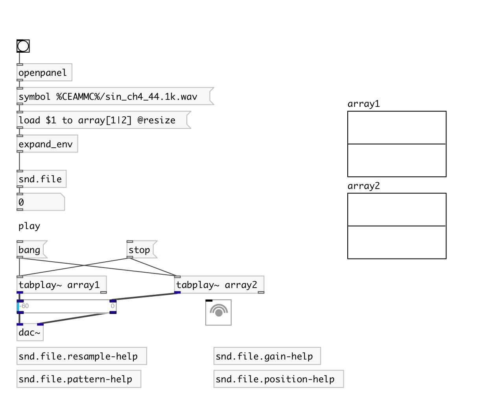

[< reference home](index.html)
---

# snd.file

Sound file loader on steroids

---

Deal with sound files: gets files info and loads them into arrays. Various formats
            are supported. Supports array name patterns.
 

---

---
arguments:

---
properties:

@formats: list of supported
            formats 
@sr: source file samplerate 
@filename: filename 
@samples: list of loaded samples to each
            array 
@smpte_fr: SMPTE
            framerate for SMPTE offset calculations 

