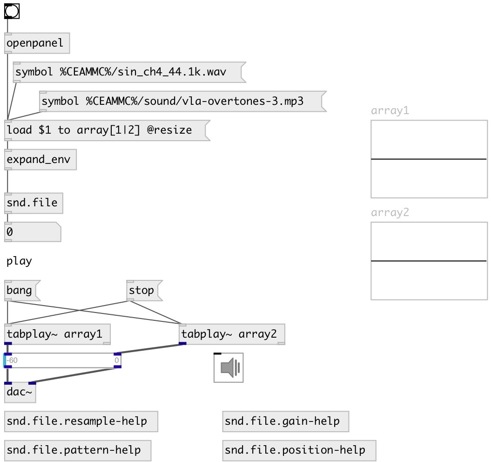

[index](index.html) :: [snd](category_snd.html)
---

# snd.file

###### Sound file loader on steroids

*available since version:* 0.1

---

## information
Deal with sound files: gets files info and loads them into arrays. Various formats are supported. Supports array name patterns.

## methods:

* **load**
Loads sound file. Outputs info properties and number of loaded samples after
load. 
  __parameters:__
  - **PATH** path to soundfile 
    type: symbol  
    required: True  

  - **to ARRAY_NAME** destination array names or pattern. Array patterns specified in square braces: array_[1-4] means - array_1, array_2, array_3, array_4. array_[left|right] means array_left and array_right 
    type: symbol  
    required: True  

  - **[@resize]** resize array to fit loaded samples 
    type: property  

  - **[@channel N]** specify input channels. Spaces separated list or range x-y. 
    type: property  

  - **[@normalize]** normalize array after loading 
    type: property  

  - **[@gain V]** apply gain to loaded samples, examples: +3.1db, -6db, 0.5 etc. 
    type: property  

  - **[@begin X]** specify input file begin position, by default in samples, but you can use other units: 1s, 10ms, 00:01.12 (smpte). To specify value relative to file end you can use $-X syntax 
    type: property  

  - **[@end X]** specify input file end position, by default in samples, but you can use other units: 1s, 10ms, 00:01.12 (smpte). To specify value relative to file end you can use $-X syntax 
    type: property  

  - **[@length X]** specify input length, by default in samples, but you can use other units: 1s, 10ms, 00:00:02.00 (smpte) 
    type: property  

  - **[@offset SAMPLES]** offset in samples from beginning of file. Deprecated, use @begin instead 
    type: property  

  - **[@resample R?]** if R is not specified - resample from file samplerate to current Pd samplerate. But you can manually specify R as float value or integer fraction - 44100/48000 
    type: property  

## properties:

* **@formats** (readonly)
Get list of supported formats 
_type:_ list 
_default:_ AAC AIFF ALAC AU AVR CAF FLAC HTK IFF MACE3:1 MACE6:1 MAT4 MAT5 MP3 MP4 MPC OGG PAF PVF RAW RF64 SD2 SDS SF VOC W64 WAV WAVEX WVE XI 

* **@sr** (readonly)
Get source file samplerate 
_type:_ list 

* **@filename** (readonly)
Get filename 
_type:_ list 

* **@samples** (readonly)
Get list of number of loaded samples into each array 
_type:_ list 

* **@channels** (readonly)
Get list of loaded channels into each array 
_type:_ list 

* **@smpte_fr** 
Get/set SMPTE framerate for SMPTE offset calculations 
_type:_ float 
_range:_ 1..99 
_default:_ 30 

* **@verbose** 
Get/set verbose output to Pd window 
_type:_ int 
_enum:_ 0, 1 
_default:_ 0 

## inlets:

* input inlet 
_type:_ control

## outlets:

* number of loaded samples 
_type:_ control

## keywords:

[soundfiler](keywords/soundfiler.html)

**Authors:** Serge Poltavsky

**License:** GPL3 or later

