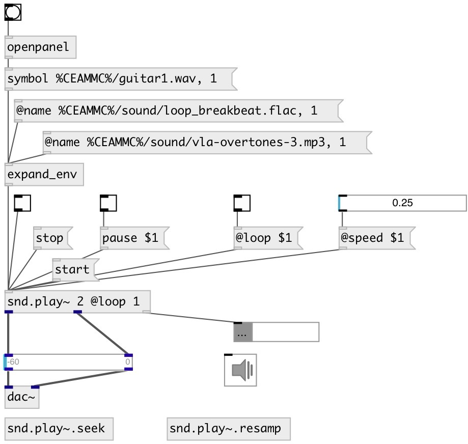

[index](index.html) :: [snd](category_snd.html)
---

# snd.play~

###### Sound file player on steriods

*available since version:* 0.9.7

---

## information
Supports variable speed playing, pausing, seeking, time-stretching and resampling

## arguments:

* **N**
number of output channels 
_type:_ int 

* **NAME**
absolute or relative to patch soundfile name 
_type:_ symbol 

## methods:

* **start**
start playing 
  __parameters:__
  - **[FLAG]** start/stop flag. If true or ommited: start, if false: stop. 
    type: bool  

* **stop**
stop playing 
  __parameters:__
  - **[FLAG]** start/stop flag. If true or ommited: stop, if false: start. 
    type: bool  

* **pause**
pause 
  __parameters:__
  - **[FLAG]** pause/resume flag. If true or ommited: pause, if false: resume. 
    type: bool  

* **ff**
fast forward by specified amount of timne 
  __parameters:__
  - **[TIME]** time amount. Can&#39;t be in seconds, milliseconds, samples, SMPTE. If the time unit is not specified treat float values as samples. If argument is not specified: jump one second forward. 
    type: atom  

* **rewind**
move backwards by specified amount of time (relative value) 
  __parameters:__
  - **[TIME]** time amount. Can&#39;t be in seconds, milliseconds, samples, SMPTE. If the time unit is not specified treat float values as milliseconds. If arguments is not specified jump: one second backward. 
    type: atom  

* **seek**
move to specified time (absolute value) 
  __parameters:__
  - **[TIME]** Time position. Can&#39;t be in seconds, milliseconds, samples, SMPTE. If the time unit is not specified treat float values as milliseconds. If arguments is not specified jump: seek to the beginning 
    type: atom  

## properties:

* **@n** (initonly)
Get/set number of output channels 
_type:_ int 
_range:_ 1..32 
_default:_ 2 

* **@name** 
Get/set absolute or relative to patch soundfile name 
_type:_ symbol 

* **@begin** 
Get/set start playing position 
_type:_ atom 
_units:_ samp, sec, ms, smpte 
_default:_ 0 

* **@end** 
Get/set end playing position 
_type:_ atom 
_units:_ samp, sec, ms, smpte 
_default:_ -1 

* **@loop** 
Get/set play in the loop 
_type:_ bool 
_default:_ 0 

* **@sync** 
Get/set sync mode. &#39;now&#39;: immidiately starts playing (abort previous) after receving
start message. &#39;defer&#39;: wait until previous playing will be done, that starts
new. &#39;wait&#39;: do not playing until previous playing will not finished 
_type:_ symbol 
_enum:_ now, defer, wait 
_default:_ now 

* **@stretch** 
Get/set stretch mode. If true: use timestretch and pitch-shifting 
_type:_ bool 
_default:_ 0 

* **@pitch** 
Get/set pitch-shift correction. Used only if @stretch mode enabled. 
_type:_ float 
_range:_ 0.25..4 
_default:_ 1 

* **@speed** 
Get/set playing speed. If @stretch mode is disabled (default): changes playing speed
(also with pitch change respectively) in realtime. If @stretch mode is enabled:
can only change speed (without pitch change) only on the next playing cycle 
_type:_ float 
_range:_ 0.25..4 
_default:_ 1 

## inlets:

* 1: start playing, 0: stop 
_type:_ control

## outlets:

* first output channel 
_type:_ audio
* ... output channel 
_type:_ audio
* n-th output channel 
_type:_ audio
* control output 
_type:_ control

## keywords:

[play](keywords/play.html)
[sound](keywords/sound.html)

**Authors:** Serge Poltavsky

**License:** GPL3 or later

