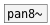

[<<< reference home](ceammc_lib.md)
---

# spat.pan4~

```


[osc~ 1000] [ui.knob]     [ui.knob]
|           |             |
|           |             |
|           [* 6.2831852] |
|           |             |
|           [@angle $1(   [@dist $1(
|           |             |
|           |             |
|           |             |
[spat.pan4~ 3.141592  0.8  ]
|       ^|      ^^|     ^^^|
[ui.m~] [ui.m~] [ui.m~] [ui.m~]


[ui.dsp~]

            
```
---
GMEM SPAT: 4-outputs spatializer
---
arguments:

ANGLE: circle panning position in
            radians<br>

---
properties:

@angle: 
            panning position in radians<br>
@dist: distance from
            circle center<br>
@active: on/off dsp
            processing<br>

---
see also:<br>
[](pan8~.md)
