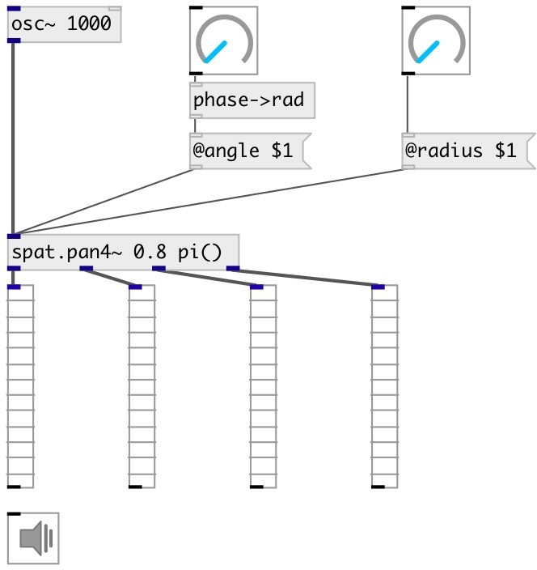

[index](index.html) :: [spat](category_spat.html)
---

# spat.pan4~

###### GMEM SPAT: 4-outputs spatializer

*available since version:* 0.6

---

## arguments:

* **RADIUS**
panning radius 
__type:__ float 

* **ANGLE**
circle panning position in radians 
__type:__ float 
__units:__ rad 

## properties:

* **@angle** 
Get/set panning position in radians 
__type:__ float 
__range:__ 0..2π 
__default:__ 0 

* **@radius** 
Get/set distance from circle center 
__type:__ float 
__range:__ 0..1 
__default:__ 1 

* **@active** 
Get/set on/off dsp processing 
__type:__ int 
__enum:__ 0, 1 
__default:__ 1 

## inlets:

* input signal 
__type:__ audio 

## outlets:

* 1st output channel
__type:__ audio 
* 2nd output channel
__type:__ audio 
* 3rd output channel
__type:__ audio 
* 4th output channel
__type:__ audio 

## keywords:

[spat](keywords/spat.html)
[span](keywords/span.html)

**See also:**
[\[pan8~\]](pan8~.html)

**Authors:** Serge Poltavsky

**License:** GPL3 or later

