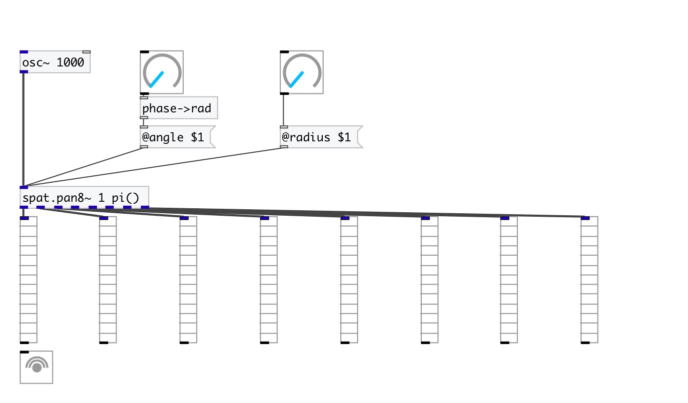
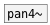

[< reference home](index.html)
---

# spat.pan8~

GMEM SPAT: 8-outputs spatializer

---

 

---

---
arguments:

ANGLE: circle panning position in
            radians 

---
properties:

@angle: 
            panning position in radians 
@dist: distance from
            circle center 
@active: on/off dsp
            processing 

---
see also: 

