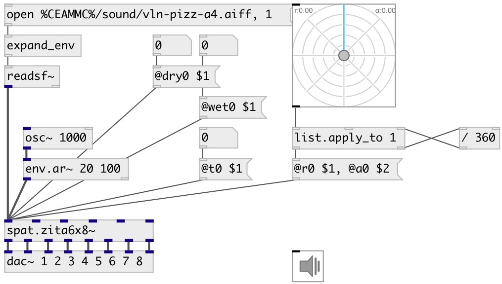

[index](index.html) :: [spat](category_spat.html)
---

# spat.zita6x8~

###### spat with 6 inputs sources to 8 channel output

*available since version:* 0.9.1

---

## methods:

* **reset**
reset reverb 

## properties:

* **@a0** 
Get/set 1st source panning position 
_type:_ float 
_range:_ 0..1 
_default:_ 0 

* **@a1** 
Get/set 2nd source panning position 
_type:_ float 
_range:_ 0..1 
_default:_ 0 

* **@a2** 
Get/set 3rd source panning position 
_type:_ float 
_range:_ 0..1 
_default:_ 0 

* **@a3** 
Get/set 4th source panning position 
_type:_ float 
_range:_ 0..1 
_default:_ 0 

* **@a4** 
Get/set 5th source panning position 
_type:_ float 
_range:_ 0..1 
_default:_ 0 

* **@a5** 
Get/set 6th source panning position 
_type:_ float 
_range:_ 0..1 
_default:_ 0 

* **@r0** 
Get/set 1st source distance from circle center 
_type:_ float 
_range:_ 0..1 
_default:_ 1 

* **@r1** 
Get/set 2nd source distance from circle center 
_type:_ float 
_range:_ 0..1 
_default:_ 1 

* **@r2** 
Get/set 3rd source distance from circle center 
_type:_ float 
_range:_ 0..1 
_default:_ 1 

* **@r3** 
Get/set 4th source distance from circle center 
_type:_ float 
_range:_ 0..1 
_default:_ 1 

* **@r4** 
Get/set 5th source distance from circle center 
_type:_ float 
_range:_ 0..1 
_default:_ 1 

* **@r5** 
Get/set 6th source distance from circle center 
_type:_ float 
_range:_ 0..1 
_default:_ 1 

* **@t0** 
Get/set 1st source reverb time (in seconds) to decay 60dB in low and mid-frequency band 
_type:_ float 
_units:_ sec 
_range:_ 0..90 
_default:_ 2 

* **@t1** 
Get/set 2nd source reverb time (in seconds) to decay 60dB in low and mid-frequency band 
_type:_ float 
_units:_ sec 
_range:_ 0..90 
_default:_ 2 

* **@t2** 
Get/set 3rd source reverb time (in seconds) to decay 60dB in low and mid-frequency band 
_type:_ float 
_units:_ sec 
_range:_ 0..90 
_default:_ 2 

* **@t3** 
Get/set 4th source reverb time (in seconds) to decay 60dB in low and mid-frequency band 
_type:_ float 
_units:_ sec 
_range:_ 0..90 
_default:_ 2 

* **@t4** 
Get/set 5th source reverb time (in seconds) to decay 60dB in low and mid-frequency band 
_type:_ float 
_units:_ sec 
_range:_ 0..90 
_default:_ 2 

* **@t5** 
Get/set 6th source reverb time (in seconds) to decay 60dB in low and mid-frequency band 
_type:_ float 
_units:_ sec 
_range:_ 0..90 
_default:_ 2 

* **@dry0** 
Get/set 1st source direct sound level 
_type:_ float 
_units:_ db 
_range:_ -60..0 
_default:_ -3 

* **@dry1** 
Get/set 2nd source direct sound level 
_type:_ float 
_units:_ db 
_range:_ -60..0 
_default:_ -3 

* **@dry2** 
Get/set 3rd source direct sound level 
_type:_ float 
_units:_ db 
_range:_ -60..0 
_default:_ -3 

* **@dry3** 
Get/set 4th source direct sound level 
_type:_ float 
_units:_ db 
_range:_ -60..0 
_default:_ -3 

* **@dry4** 
Get/set 5th source direct sound level 
_type:_ float 
_units:_ db 
_range:_ -60..0 
_default:_ -3 

* **@dry5** 
Get/set 6th source direct sound level 
_type:_ float 
_units:_ db 
_range:_ -60..0 
_default:_ -3 

* **@wet0** 
Get/set 1st source reverb sound level 
_type:_ float 
_units:_ db 
_range:_ -60..0 
_default:_ -8 

* **@wet1** 
Get/set 2nd source reverb sound level 
_type:_ float 
_units:_ db 
_range:_ -60..0 
_default:_ -8 

* **@wet2** 
Get/set 3rd source reverb sound level 
_type:_ float 
_units:_ db 
_range:_ -60..0 
_default:_ -8 

* **@wet3** 
Get/set 4th source reverb sound level 
_type:_ float 
_units:_ db 
_range:_ -60..0 
_default:_ -8 

* **@wet4** 
Get/set 5th source reverb sound level 
_type:_ float 
_units:_ db 
_range:_ -60..0 
_default:_ -8 

* **@wet5** 
Get/set 6th source reverb sound level 
_type:_ float 
_units:_ db 
_range:_ -60..0 
_default:_ -8 

* **@active** 
Get/set on/off dsp processing 
_type:_ bool 
_default:_ 1 

* **@osc** (initonly)
Get/set OSC server name to listen 
_type:_ symbol 

* **@id** (initonly)
Get/set OSC address id. If specified, bind all properties to /ID/spat_zita6x8/PROP_NAME
osc address, if empty bind to /spat_zita6x8/PROP_NAME. 
_type:_ symbol 

## inlets:

* 1st source input 
_type:_ audio
* 2nd source input 
_type:_ audio
* 3rd source input 
_type:_ audio
* 4th source input 
_type:_ audio
* 5th source input 
_type:_ audio
* 6th source input 
_type:_ audio

## outlets:

* 1st output 
_type:_ audio
* 2dn output 
_type:_ audio
* 3rd output 
_type:_ audio
* 4th output 
_type:_ audio
* 5th output 
_type:_ audio
* 6th output 
_type:_ audio
* 7th output 
_type:_ audio
* 8th output 
_type:_ audio

## keywords:

[fx](keywords/fx.html)
[spat](keywords/spat.html)
[zita](keywords/zita.html)

**Authors:** Serge Poltavsky

**License:** GPL3 or later

