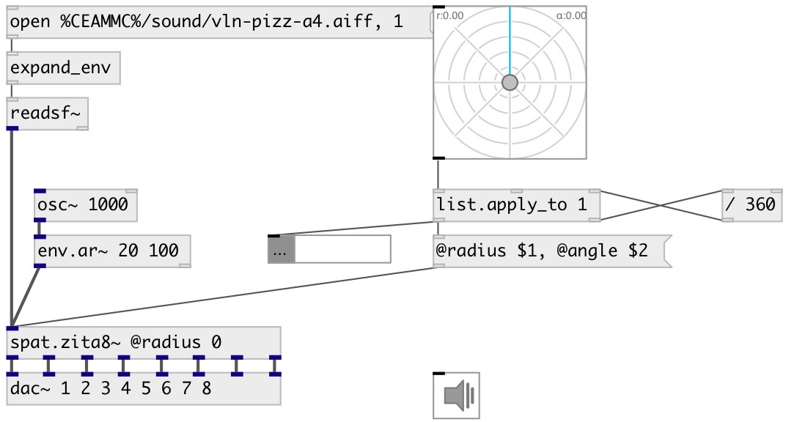

[index](index.html) :: [spat](category_spat.html)
---

# spat.zita8~

###### 8 channel reverb spatializer

*available since version:* 0.9.4

---

## arguments:

* **RADIUS**
@radius property 
_type:_ float 

* **ANGLE**
@angle property 
_type:_ float 

## methods:

* **reset**
reset spat and reverb 

## properties:

* **@angle** 
Get/set source panning position 
_type:_ float 
_range:_ 0..1 
_default:_ 0 

* **@radius** 
Get/set source distance from circle center 
_type:_ float 
_range:_ 0..1 
_default:_ 1 

* **@decay_low** 
Get/set time (in seconds) to decay 60dB in low-frequency band 
_type:_ float 
_units:_ sec 
_range:_ 1..60 
_default:_ 3 

* **@decay_mid** 
Get/set time (in seconds) to decay 60dB in mid-frequency band 
_type:_ float 
_units:_ sec 
_range:_ 1..60 
_default:_ 2 

* **@delay** 
Get/set a delay of 20 to 100 ms operating on the &#39;wet&#39; signal. Large values will
provide the impression of a larger room 
_type:_ float 
_units:_ ms 
_range:_ 20..100 
_default:_ 60 

* **@freq_low** 
Get/set Crossover frequency (Hz) separating low and middle frequencies 
_type:_ float 
_units:_ Hz 
_range:_ 50..1000 
_default:_ 200 

* **@dump_hf** 
Get/set Frequency (Hz) at which the high-frequency T60 is half the middle-band&#39;s T60 
_type:_ float 
_units:_ Hz 
_range:_ 1500..47040 
_default:_ 6000 

* **@active** 
Get/set on/off dsp processing 
_type:_ bool 
_default:_ 1 

## inlets:

* input 
_type:_ audio

## outlets:

* 1st output 
_type:_ audio
* 2dn output 
_type:_ audio
* 3rd output 
_type:_ audio
* 4th output 
_type:_ audio
* 5th output 
_type:_ audio
* 6th output 
_type:_ audio
* 7th output 
_type:_ audio
* 8th output 
_type:_ audio

## keywords:

[fx](keywords/fx.html)
[spat](keywords/spat.html)
[zita](keywords/zita.html)

**Authors:** Serge Poltavsky

**License:** GPL3 or later

