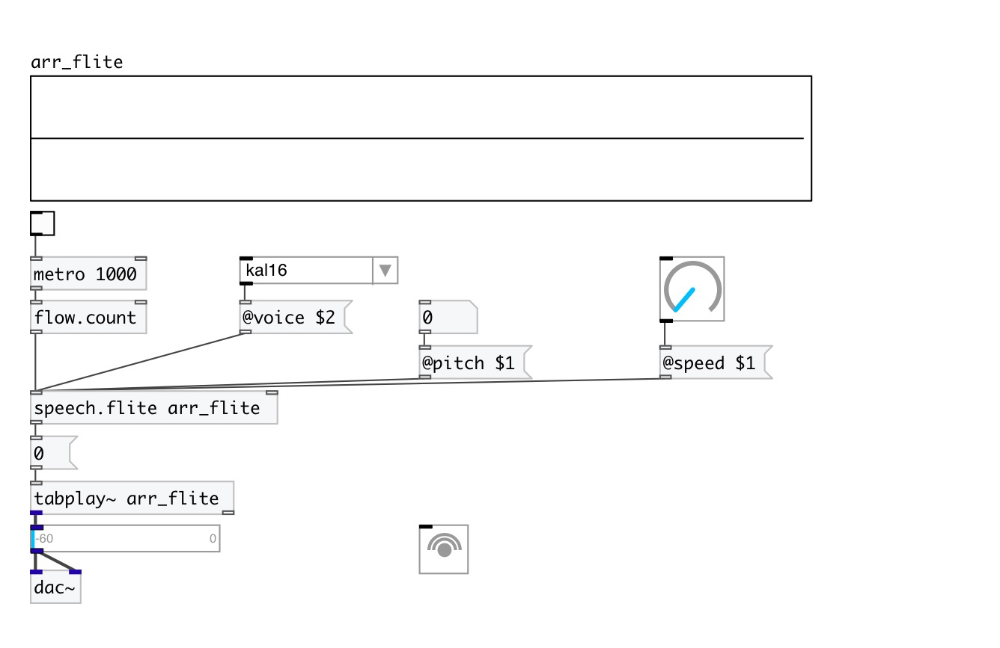

[< reference home](index.html)
---

# speech.flite

render speech to array

---

Renders floats, symbols and list to wavetables using flite TTS engine.
Rendering is performed in separate thread.
 

---

---
arguments:

ARRAY: destination array name render to 

---
properties:

@array: destination array name 
@voice: default
            voice 
@speed: speaking
            speed 
@pitch: voice pitch (-1 - default
            value) 

