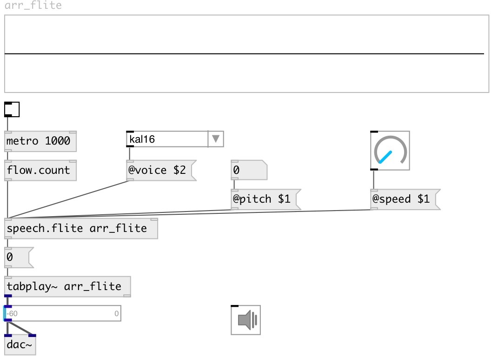

[index](index.html) :: [misc](category_misc.html)
---

# speech.flite

###### render speech to array

*available since version:* 0.6

---

## information
Renders floats, symbols and list to wavetables using flite TTS engine.
Rendering is performed in separate thread.

## arguments:

* **ARRAY**
destination array name render to 
__type:__ symbol 

## properties:

* **@array** 
Get/set destination array name 
__type:__ symbol 

* **@voice** 
Get/set default voice 
__type:__ symbol 
__enum:__ kal16, slt, rms, awb 
__default:__ kal16 

* **@speed** 
Get/set speaking speed 
__type:__ float 
__range:__ 1..4 
__default:__ 1 

* **@pitch** 
Get/set voice pitch (-1 - default value) 
__type:__ float 
__default:__ -1 

## inlets:

* render number to array 
__type:__ control 
* set target array name 
__type:__ control 

## outlets:

* bang on done
__type:__ control 

## keywords:

[speak](keywords/speak.html)
[speech](keywords/speech.html)
[flite](keywords/flite.html)

**Authors:** Serge Poltavsky

**License:** GPL3 or later

