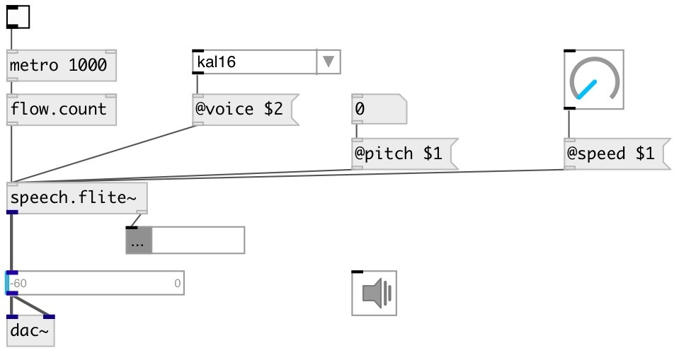

[index](index.html) :: [misc](category_misc.html)
---

# speech.flite~

###### render speech to array

*available since version:* 0.9.2

---

## information
Speaks floats, symbols and list to wavetables using flite TTS engine.

## methods:

* **stop**
stops speech and clear speech queue 

## properties:

* **@voice** 
Get/set default voice 
_type:_ symbol 
_enum:_ kal16, slt, rms, awb 
_default:_ kal16 

* **@speed** 
Get/set speaking speed 
_type:_ float 
_range:_ 0.5..4 
_default:_ 1 

* **@pitch** 
Get/set voice pitch (-1 - default value) 
_type:_ float 
_default:_ -1 

## inlets:

* speak number 
_type:_ control

## outlets:

* output signal 
_type:_ audio
* float: number of sentences left to speak 
_type:_ control

## keywords:

[speak](keywords/speak.html)
[speech](keywords/speech.html)
[flite](keywords/flite.html)

**See also:**
[\[speech.flite\]](speech.flite.html)

**Authors:** Serge Poltavsky

**License:** GPL3 or later

