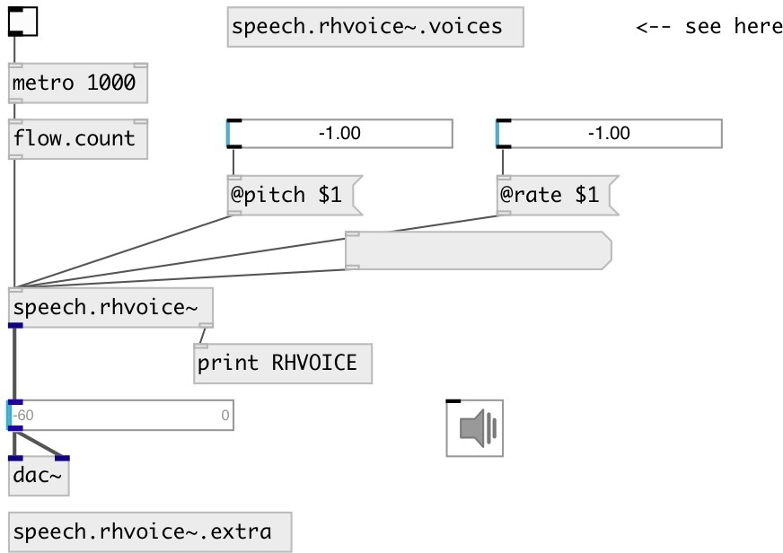

[index](index.html) :: [misc](category_misc.html)
---

# speech.rhvoice~
**aliases:** [ceammc/rhvoice\~], [rhvoice\~]

###### RHVoice text to speech synthesis

*available since version:* 0.9.5

---

## information
Note: no voices data in distributed with PureData-ceammc, you have to install voices manually Download language and voice datafiles and put them into ~/Documents/Pd/rhvoice directory

## methods:

* **stop**
stops speech and clear TTS queue 

* **clear**
clear TTS queue 

## properties:

* **@voice** 
Get/set voice 
_type:_ symbol 
_default:_ Anna 

* **@rate** 
Get/set speaking rate 
_type:_ float 
_range:_ -1..1 
_default:_ 0 

* **@pitch** 
Get/set voice pitch 
_type:_ float 
_range:_ -1..1 
_default:_ 0 

* **@volume** 
Get/set voice volume 
_type:_ float 
_range:_ 0..1 
_default:_ 1 

## inlets:

* speak number 
_type:_ control

## outlets:

* TTS output 
_type:_ audio
* bang on done 
_type:_ control

## keywords:

[speak](keywords/speak.html)
[speech](keywords/speech.html)
[flite](keywords/flite.html)

**See also:**
[\[speech.flite~\]](speech.flite~.html)

**Authors:** Serge Poltavsky

**License:** GPL3 or later

