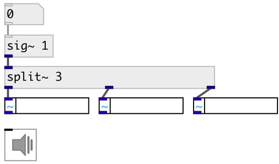

[index](index.html) :: [base](category_base.html)
---

# split~
**aliases:** [ceammc/split\~]

###### parametrized signal splitter

*available since version:* 0.9.7

---

## information
mostly syntax sugar for clear schemes, but can be used in dynamic pathing

## arguments:

* **N**
number of outputs 
_type:_ int 

## properties:

* **@n** (initonly)
Get/set number of outputs 
_type:_ int 
_range:_ 2..64 
_default:_ 2 

## inlets:

* input signal 
_type:_ audio

## outlets:

* first output signal 
_type:_ audio
* ... output signal 
_type:_ audio
* n-th output signal 
_type:_ audio

## keywords:

[merge](keywords/merge.html)
[split](keywords/split.html)

**See also:**
[\[merge~\]](merge~.html)

**Authors:** Serge Poltavsky

**License:** GPL3 or later

