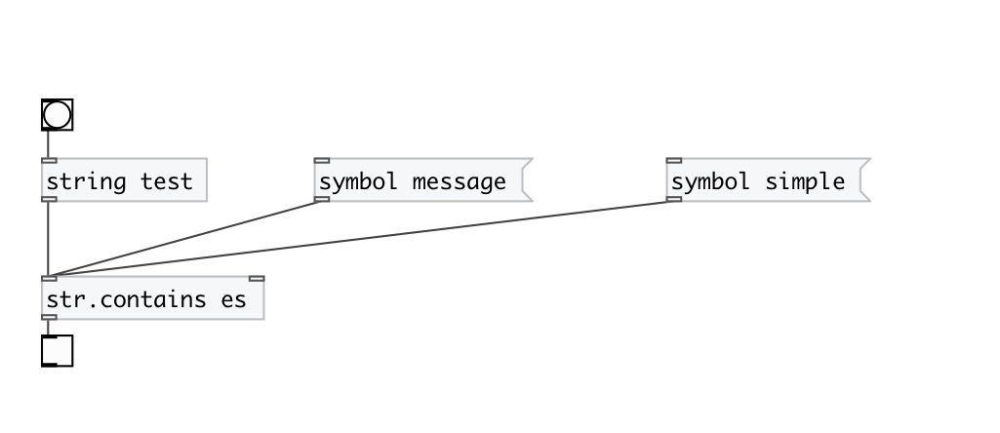

[< reference home](index.html)
---

# string.contains

checks if given string contains specified substring

---

 

---

---
arguments:

SUBSTR: searched substring 

---
properties:

---
see also: 

