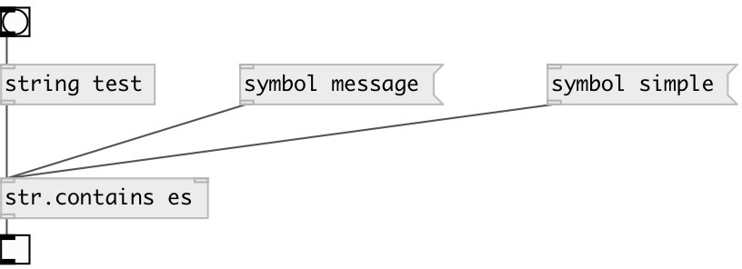

[index](index.html) :: [string](category_string.html)
---

# string.contains

###### checks if string contains specified substring

*available since version:* 0.3

---

## arguments:

* **SUBSTR**
searched substring 
_type:_ symbol 

## properties:

* **@subj** 
Get/set searched substring 
_type:_ symbol 

## inlets:

* input string or symbol 
_type:_ control
* search substring (string or symbol) 
_type:_ control

## outlets:

* output 1 if input string contains specified substring, otherwise 0 
_type:_ control

## keywords:

[contains](keywords/contains.html)
[search](keywords/search.html)

**See also:**
[\[str.ends_with\]](str.ends_with.html)

**Authors:** Serge Poltavsky

**License:** GPL3 or later

