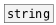

[<<< reference home](ceammc_lib.md)
---

# string.equal

```


[B]
|
[string Chuck] [symbol Chuck?(
|              |
[string.equal Chuck]
|
[T]

            
```
---
check strings for equality
---
arguments:

STR: second string initial value<br>

---
properties:


---
see also:<br>
[](string.md)
