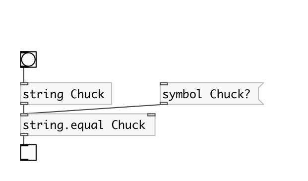

[index](index.html) :: [string](category_string.html)
---

# string.equal
**aliases:** [str.equal]

###### check strings or symbols for equality

*available since version:* 0.3

---

## arguments:

* **STR**
second string initial value 
_type:_ symbol 

## properties:

* **@subj** 
Get/set string to compare 
_type:_ symbol 

## inlets:

* do compare 
_type:_ control
* set compare subject 
_type:_ control

## outlets:

* outputs 1 if strings are equal, otherwise 0 
_type:_ control

## keywords:

[compare](keywords/compare.html)
[equal](keywords/equal.html)

**See also:**
[\[string\]](string.html)

**Authors:** Serge Poltavsky

**License:** GPL3 or later

