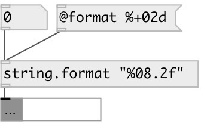

[index](index.html) :: [string](category_string.html)
---

# string.format

###### formats string like printf.

*available since version:* 0.3

---

## information
This format modifiers are supported: %d, %u, %i, %o, %x, %X, %s, %e, %E.

## arguments:

* **FMT**
format string 
_type:_ symbol 

## properties:

* **@format** 
Get/set format string 
_type:_ list 

* **@int** 
Get/set flag for integer mode. If specified all floats are converted to integers. This
usefull for hex and octal formatting 
_type:_ flag 
_default:_ 0 

## inlets:

* float format argument 
_type:_ control

## outlets:

* output string 
_type:_ control

## keywords:

[string](keywords/string.html)
[format](keywords/format.html)

**Authors:** Serge Poltavsky

**License:** GPL3 or later

