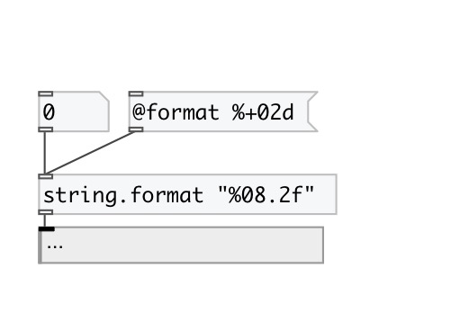

[< reference home](index.html)
---

# string.format

formats string like printf.

---

This format modifiers are supported: %d, %u, %i, %o, %x, %X, %s, %e, %E.
 

---

---
arguments:

FMT: format string 

---
properties:

@format: format string 
@int: flag for integer mode. If specified all floats are
            converted to integers. This usefull for hex and octal formatting 

