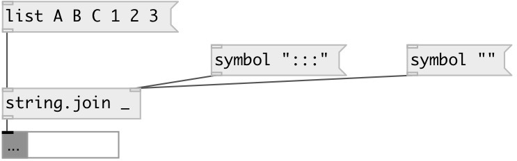

[index](index.html) :: [string](category_string.html)
---

# string.join
**aliases:** [str.join]

###### joins (concatenates) strings with separator

*available since version:* 0.3

---

## arguments:

* **SEP**
separator. For space use quotes. 
_type:_ list 

## properties:

* **@sep** 
Get/set separator 
_type:_ symbol 

## inlets:

* symbol passed untouched 
_type:_ control
* change separator to new 
_type:_ control

## outlets:

* result String 
_type:_ control

## keywords:

[join](keywords/join.html)

**See also:**
[\[string.split\]](string.split.html)

**Authors:** Alex Nadzharov, Serge Poltavsky

**License:** GPL3 or later

