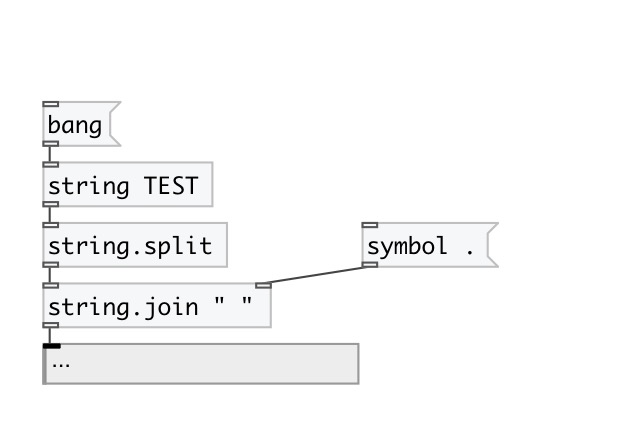

[< reference home](index.html)
---

# string.join

joins (concatenates) strings with separator

---

 

---

---
arguments:

SEP: separator. For space use &#39; &#39;. 

---
properties:

@sep: separator 

---
see also: 

