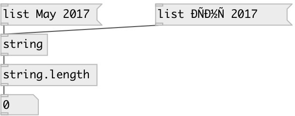

[index](index.html) :: [string](category_string.html)
---

# string.length

###### number of characters in string (unicode supported)

*available since version:* 0.3

---

## inlets:

* input string or symbol. Unicode strings also supported. 
__type:__ control 

## outlets:

* length of string: number of character
__type:__ control 

## keywords:

[string](keywords/string.html)
[length](keywords/length.html)

**Authors:** Alex Nadzharov, Serge Poltavsky

**License:** GPL3 or later

