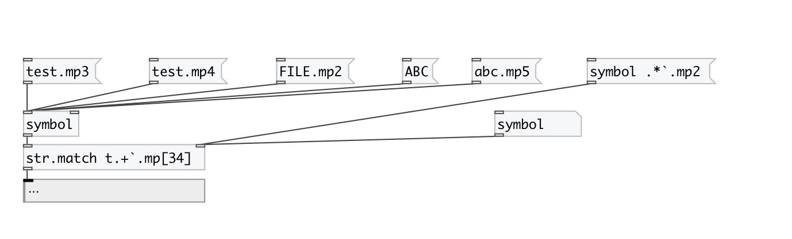

[< reference home](index.html)
---

# string.match

check if string match regular expression

---

Used syntax: re2 (like pcre). Some characters are non-supported in Pd. Use `
            instead of backslash, `` instead of `, (( instead of {, )) instead of }, .. instead of
            comma, `: instead of semicolon
For example, all digits: `d+, two or three chars: [a-z]((2..3)) etc.
 

---

---
arguments:

RE: regular expression 

---
properties:

@re: regular expression 

