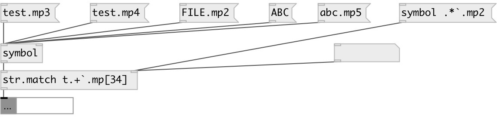

[index](index.html) :: [string](category_string.html)
---

# string.match

###### check if string match regular expression

*available since version:* 0.7.1

---

## information
Used syntax: re2 (like pcre). Some characters are non-supported in Pd. Use `
            instead of backslash, `` instead of `, (( instead of {, )) instead of }, .. instead of
            comma, `: instead of semicolon
If you need spaces: you should quote the string, also note that in quoted string `
            symbol should be escaped like ``.
For example, all digits: `d+, two or three chars: [a-z]((2..3)) etc.

## arguments:

* **RE**
regular expression 
_type:_ symbol 

## properties:

* **@re** 
Get/set regular expression 
_type:_ list 

## inlets:

* input string or symbol 
_type:_ control
* change regular expression 
_type:_ control

## outlets:

* output 1 on successfull match, otherwise 0 
_type:_ control

## keywords:

[match](keywords/match.html)
[regex](keywords/regex.html)

**Authors:** Serge Poltavsky

**License:** GPL3 or later

