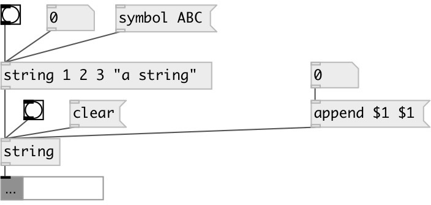

[index](index.html) :: [string](category_string.html)
---

# string

###### string constructor

*available since version:* 0.3

---

## arguments:

* **STR**
initial string 
__type:__ symbol 

## methods:

* **clear**
clear string without output 

* **set**
set string content without output 

* **append**
append values to the end of string 

## properties:

* **@value** 
Get/set string value 
__type:__ list 

## inlets:

* outputs string value 
__type:__ control 

## outlets:

* string data
__type:__ control 

## keywords:

[string](keywords/string.html)
[data](keywords/data.html)

**Authors:** Serge Poltavsky

**License:** GPL3 or later

