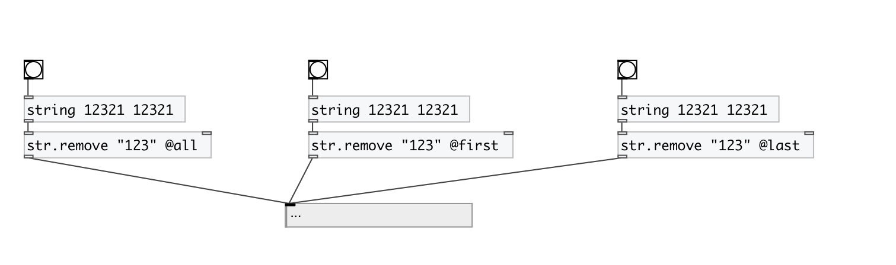

[< reference home](index.html)
---

# string.remove

remove substring from input string

---

 

---

---
arguments:

STR: substring to remove 

---
properties:

@mode: remove
            mode 
@all: alias to @mode all - remove all occurences in input
            string 
@first: alias to @mode first - remove first occurence in
            input string 
@last: alias to @mode last - remove last occurence in
            input string 

