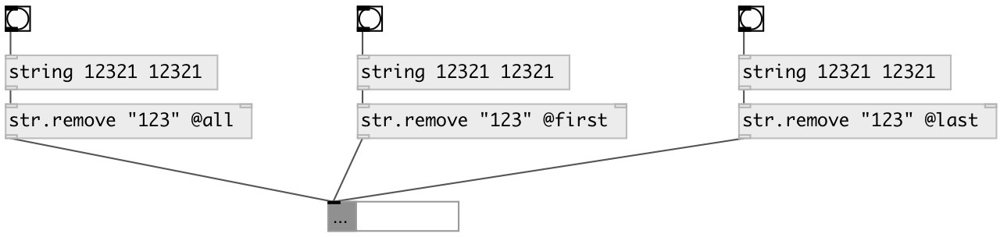

[index](index.html) :: [string](category_string.html)
---

# string.remove

###### remove substring from input string

*available since version:* 0.3

---

## arguments:

* **STR**
substring to remove 
__type:__ symbol 

## properties:

* **@mode** 
Get/set remove mode 
__type:__ symbol 
__enum:__ all, first, last 
__default:__ all 

* **@all** 
Get/set alias to @mode all - remove all occurences in input string 
__type:__ alias 

* **@first** 
Get/set alias to @mode first - remove first occurence in input string 
__type:__ alias 

* **@last** 
Get/set alias to @mode last - remove last occurence in input string 
__type:__ alias 

* **@str** 
Get/set removed string 
__type:__ symbol 

## inlets:

* input string or symbol 
__type:__ control 
* set removed string or symbol 
__type:__ control 

## outlets:

* output string
__type:__ control 

## keywords:

[remove](keywords/remove.html)

**Authors:** Serge Poltavsky

**License:** GPL3 or later

