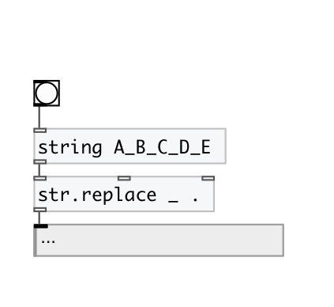
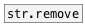

[< reference home](index.html)
---

# string.replace

replace from one substring to another in input string

---

 

---

---
arguments:

FROM: substring for replace 
TO: substring to replace 

---
properties:

@from: replace from 
@to: replace to 
@mode: replace
            mode 
@all: alias to @mode all - replace all occurences in input
            string 
@first: alias to @mode first - replace first occurence in
            input string 
@last: alias to @mode last - replace last occurence in
            input string 

---
see also: 

