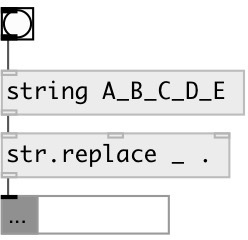

[index](index.html) :: [string](category_string.html)
---

# string.replace
**aliases:** [str.replace]

###### replace from one substring to another in input string

*available since version:* 0.3

---

## arguments:

* **FROM**
substring for replace 
_type:_ symbol 

* **TO**
substring to replace 
_type:_ symbol 

## properties:

* **@from** 
Get/set replace from 
_type:_ symbol 

* **@to** 
Get/set replace to 
_type:_ symbol 

* **@mode** 
Get/set replace mode 
_type:_ symbol 
_enum:_ all, first, last 
_default:_ all 

* **@all** 
Get/set alias to @mode all - replace all occurences in input string 
_type:_ alias 

* **@first** 
Get/set alias to @mode first - replace first occurence in input string 
_type:_ alias 

* **@last** 
Get/set alias to @mode last - replace last occurence in input string 
_type:_ alias 

## inlets:

* input string or symbol 
_type:_ control
* from 
_type:_ control
* to 
_type:_ control

## outlets:

* output string 
_type:_ control

## keywords:

[replace](keywords/replace.html)

**See also:**
[\[str.remove\]](str.remove.html)

**Authors:** Serge Poltavsky

**License:** GPL3 or later

