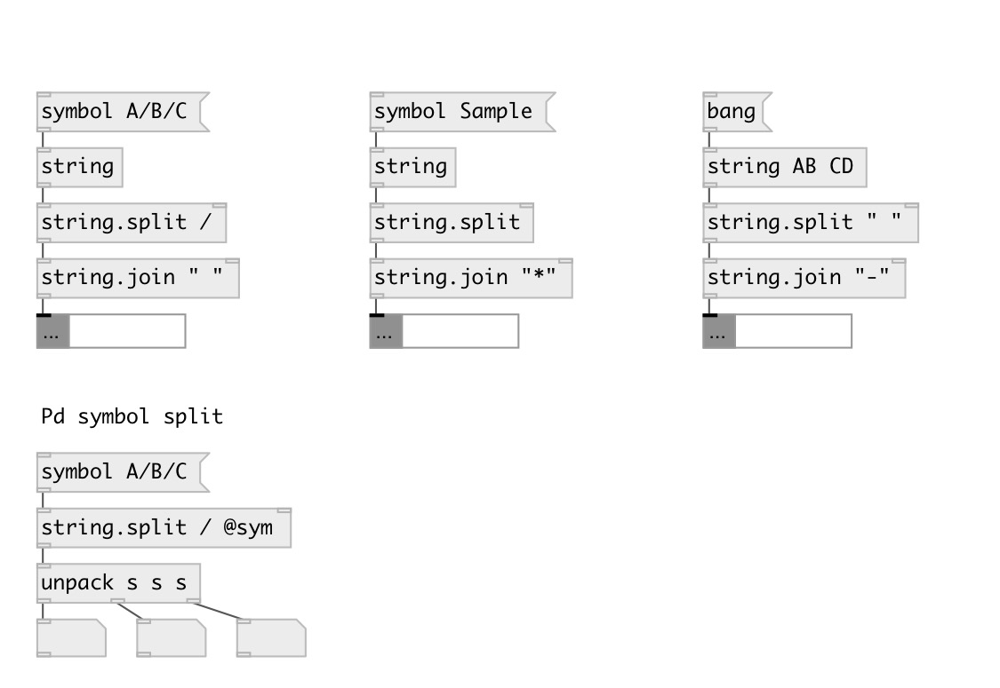

[index](index.html) :: [string](category_string.html)
---

# string.split

###### split string by separator

*available since version:* 0.3

---

## information
Note: by default string or symbol splitted to list of data:String, to get list of
            Pd symbols use @sym flag

## arguments:

* **SEP**
separator. If nonspecified - separate by every char. To separate by space - use
&#34; &#34; argument 
_type:_ atom 

## properties:

* **@sep** 
Get/set separator 
_type:_ symbol 

* **@sym** 
Get/set flag to output as list of Pd symbols 
_type:_ flag 

## inlets:

* input symbol 
_type:_ control

## outlets:

* list of data:Strings or symbols 
_type:_ control

## keywords:

[split](keywords/split.html)

**See also:**
[\[string.join\]](string.join.html)

**Authors:** Alex Nadzharov, Serge Poltavsky

**License:** GPL3 or later

