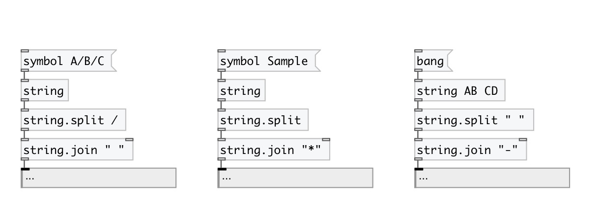
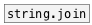

[< reference home](index.html)
---

# string.split

split string by separator

---

 

---

---
arguments:

SEP: separator. If nonspecified - separate by every char.
            To separate by space - use &#34; &#34; argument 

---
properties:

@sep: separator 

---
see also: 

