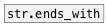

[< reference home](ceammc_lib.html)
---

# string.starts_with


checks if given string starts with specified prefix

---

<br>


---


```


[B]
|
[string CSound] [symbol SuperCollider(
|               |
|               |
|               |
[str.starts_with CSound]
|
[T]

            
```

---
arguments:

PREFIX: prefix<br>

---
properties:


---
see also:<br>
[](str.ends_with.html)
