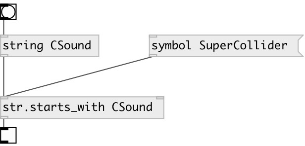

[index](index.html) :: [string](category_string.html)
---

# string.starts_with

###### checks if string starts with specified substring

*available since version:* 0.3

---

## arguments:

* **PREFIX**
prefix 
__type:__ symbol 

## properties:

* **@prefix** 
Get/set prefix 
__type:__ symbol 

## inlets:

* input string or symbol 
__type:__ control 
* search prefix (string or symbol) 
__type:__ control 

## outlets:

* output 1 if input string starts with prefix, otherwise 0
__type:__ control 

## keywords:

[starts](keywords/starts.html)
[search](keywords/search.html)

**See also:**
[\[str.ends_with\]](str.ends_with.html)

**Authors:** Serge Poltavsky

**License:** GPL3 or later

