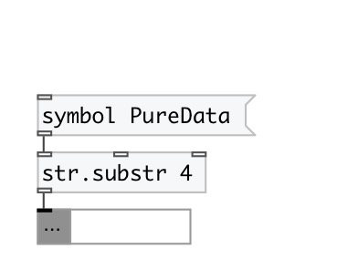

[index](index.html) :: [string](category_string.html)
---

# string.substr
**aliases:** [str.substr]

###### extract substring from input string

*available since version:* 0.3

---

## arguments:

* **FROM**
substring position. May be relative: -1 means one character from the end of
stirng 
_type:_ int 

* **LENGTH**
substring length. If -1 given (by default), means &#39;till string end&#39;. 
_type:_ int 

## properties:

* **@from** 
Get/set substring position. Can be negative - to address string from the end 
_type:_ int 
_default:_ 0 

* **@len** 
Get/set substring length. If equal to -1, substring to the end of string 
_type:_ int 
_min value:_ 0 
_default:_ -1 

## inlets:

* input string 
_type:_ control
* from 
_type:_ control
* to 
_type:_ control

## outlets:

* output substring 
_type:_ control

## keywords:

[substring](keywords/substring.html)

**See also:**
[\[string.split\]](string.split.html)

**Authors:** Alex Nadzharov, Serge Poltavsky

**License:** GPL3 or later

