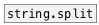

[<<< reference home](ceammc_lib.md)
---

# string.substr

```


[symbol PureData(
|
[str.substr 4]
|
[str->sym]
|
[msg set]
|
[ (

            
```
---
extract substring from input string
---
arguments:

FROM: substring position. May be relative: -1 means one
            character from the end of stirng<br>
LENGTH: substring length. If -1 given (by
            default), means &#39;till string end&#39;.<br>

---
properties:

@from: substring position. Can be negative - to
            address string from the end<br>
@len: substring length. If equal
            to -1, substring to the end of string<br>

---
see also:<br>
[](string.split.md)
