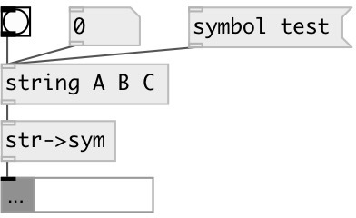

[index](index.html) :: [string](category_string.html)
---

# string2symbol

###### converts string to symbol

*available since version:* 0.3

---

## inlets:

* input string value 
_type:_ control

## outlets:

* symbol output 
_type:_ control

## keywords:

[string](keywords/string.html)
[symbol](keywords/symbol.html)
[convert](keywords/convert.html)

**Authors:** Serge Poltavsky

**License:** GPL3 or later

