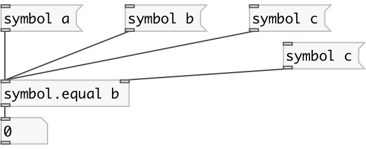

[index](index.html) :: [symbol](category_symbol.html)
---

# symbol.equal

###### check symbols for equality

*available since version:* 0.1

---

## inlets:

* first symbol 
_type:_ control
* second symbol 
_type:_ control

## outlets:

* outputs 1 if symbols are equal, otherwise 0 
_type:_ control

## keywords:

[symbol](keywords/symbol.html)
[compare](keywords/compare.html)

**Authors:** Alex Nadzharov, Serge Poltavsky

**License:** GPL3 or later

