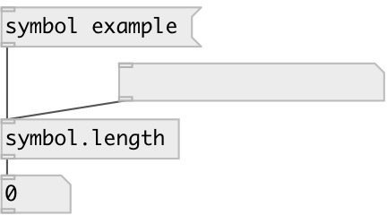

[index](index.html) :: [symbol](category_symbol.html)
---

# symbol.length

###### number of characters in symbol (unicode supported)

*available since version:* 0.1

---

## inlets:

* input symbol. Unicode strings also supported. 
_type:_ control

## outlets:

* length of symbol: number of character 
_type:_ control

## keywords:

[symbol](keywords/symbol.html)
[length](keywords/length.html)

**Authors:** Alex Nadzharov, Serge Poltavsky

**License:** GPL3 or later

