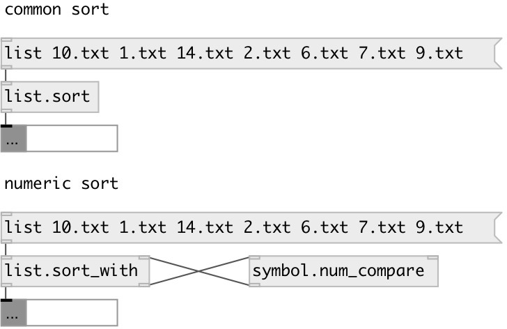

[index](index.html) :: [symbol](category_symbol.html)
---

# symbol.num_compare

###### numeric symbol compare

*available since version:* 0.4

---

## arguments:

* **WITH**
symbol to compare 
_type:_ symbol 

## properties:

* **@with** 
Get/set symbol to compare 
_type:_ symbol 

## inlets:

* first compare symbol. Unicode strings also supported 
_type:_ control
* second compare symbol. Unicode strings also supported 
_type:_ control

## outlets:

* 1 if first symbol less then second, otherwise 0 
_type:_ control

## keywords:

[symbol](keywords/symbol.html)
[num_compare](keywords/num_compare.html)
[compare](keywords/compare.html)

**Authors:** Alex Nadzharov, Serge Poltavsky

**License:** GPL3 or later

