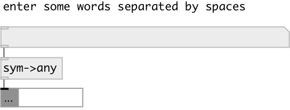

[index](index.html) :: [symbol](category_symbol.html)
---

# symbol2any

###### converts symbol or string to message

*available since version:* 0.9.1

---

## inlets:

* symbol 
__type:__ control 

## outlets:

* output message
__type:__ control 

## keywords:

[symbol](keywords/symbol.html)
[any](keywords/any.html)

**Authors:** Serge Poltavsky

**License:** GPL3 or later

