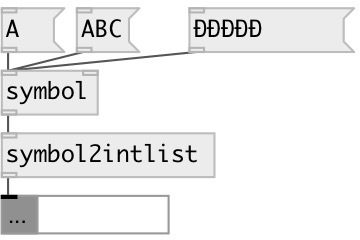

[index](index.html) :: [symbol](category_symbol.html)
---

# symbol2intlist
**aliases:** [ceammc/symbol2intlist], [ceammc/sym-&gt;ilist], [sym-&gt;ilist]

###### converts symbol to list of character codes

*available since version:* 0.9.1

---

## inlets:

* first symbol 
_type:_ control

## outlets:

* list of codes 
_type:_ control

## keywords:

[symbol](keywords/symbol.html)
[compare](keywords/compare.html)

**Authors:** Serge Poltavsky

**License:** GPL3 or later

